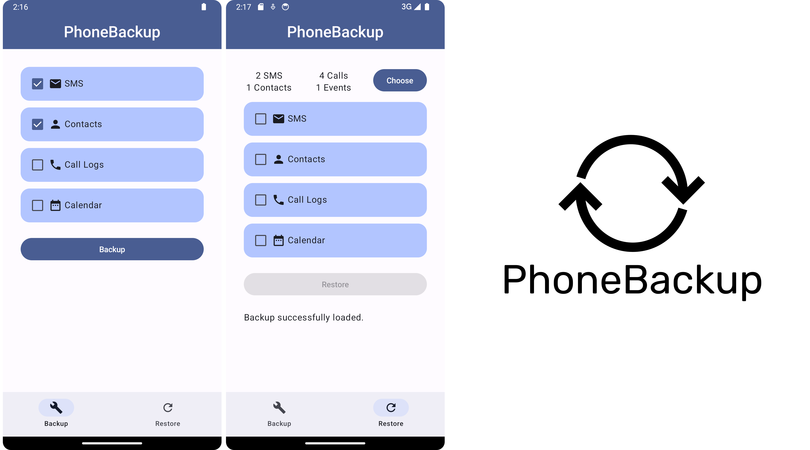

# PhoneBackup



PhoneBackup is an Android application that allows users to conveniently back up and restore SMS messages, contacts, calendars, and call logs on their Android devices.

## Getting Started

### Prerequisites

- Android Studio: Make sure you have Android Studio installed to build and run the project.

### Building

1. Clone the repository:

    ```bash
    git clone https://github.com/borabuyukbas/PhoneBackup.git
    ```

2. Open the project in Android Studio.

3. Build and run the project on your Android device or emulator.

## Contributing

If you'd like to contribute to PhoneBackup, please follow these steps:

1. Fork the repository.

2. Create a new branch for your feature: `git checkout -b feature-name`.

3. Make your changes and commit them: `git commit -m 'Add some feature'`.

4. Push to the branch: `git push origin feature-name`.

5. Create a pull request.

## License

This project is licensed under the [GNU General Public License](LICENSE.md).
